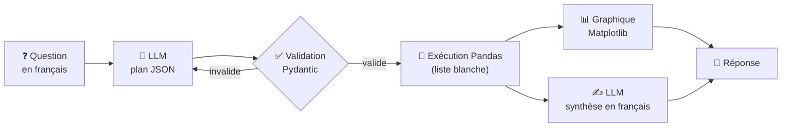

# 🤖 DataChat-FR

**Un agent IA conversationnel pour interroger en français les flux de mobilité résidentielle de l'INSEE (2018-2022).**

On pose une question en langage naturel, l'agent choisit l'analyse à faire, l'exécute sur les données avec Pandas, trace un graphique et rédige une réponse en français.


> Projet personnel d'apprentissage (POC), suite de [UrbanFlows-FR](https://github.com/amdvii/UrbanFlowsFR) : même jeu de données, mais cette fois interrogeable en langage naturel.

---

## ✨ Exemples de questions

- *« Où partent les Parisiens en 2021 ? »*
- *« Est-ce que Lyon a perdu des habitants depuis le Covid ? »*
- *« Quelles communes du Val-d'Oise attirent le plus ? »*
- *« Combien de personnes passent de Paris à Bordeaux chaque année ? »*

Plus d'exemples dans [`examples/questions.md`](examples/questions.md).

## 🧠 Architecture



Le pipeline suit 5 étapes, toutes dans [`datachat/agent.py`](datachat/agent.py) :

1. **Question** de l'utilisateur, en français.
2. **Planification** (`_generate_plan`) : le LLM traduit la question en un plan JSON, par exemple :
   ```json
   {"operation": "solde_migratoire", "commune": "Lyon", "graphique": "courbe", "titre": "Solde migratoire de Lyon"}
   ```
   Le plan est validé par un schéma **Pydantic**. S'il est invalide, l'erreur est renvoyée au LLM qui corrige sa réponse (boucle d'auto-correction).
3. **Exécution sécurisée** (`_execute_plan`) : le plan ne contient **jamais de code**. Il désigne une des 5 opérations Pandas écrites et testées à la main (`top_destinations`, `top_origines`, `solde_migratoire`, `flux_entre`, `classement_solde`). Pas d'`eval`, pas d'`exec` : le LLM ne peut rien faire d'autre que ce qui est prévu.
4. **Visualisation** automatique : barres pour un classement, courbes pour une évolution.
5. **Synthèse** (`_synthesize`) : le LLM rédige la réponse **uniquement à partir du tableau de résultats**, pour limiter les hallucinations.

Les questions hors sujet (prix de l'immobilier, météo…) sont reconnues et refusées avec une explication.

## 🗂️ Structure

```
DataChat-FR/
├── datachat/
│   ├── agent.py         # l'agent : plan → exécution → graphique → synthèse
│   ├── plan.py          # schéma Pydantic du plan JSON
│   ├── operations.py    # les 5 opérations Pandas autorisées
│   ├── prompts.py       # prompts de planification et de synthèse
│   ├── data_loader.py   # chargement, arrondissements, recherche de communes
│   ├── visualizer.py    # graphiques Matplotlib
│   └── __main__.py      # interface en ligne de commande
├── scripts/prepare_insee.py   # ETL des fichiers bruts INSEE
├── tests/                     # tests pytest (faux LLM, données synthétiques)
├── examples/questions.md
└── data/README.md             # comment récupérer les données
```

## 🚀 Installation

```bash
git clone https://github.com/amdvii/DataChat-FR.git
cd DataChat-FR
python -m venv .venv && source .venv/bin/activate   # Windows : .venv\Scripts\activate
pip install -r requirements.txt
cp .env.example .env                                # puis renseigner OPENAI_API_KEY
```

Données : voir [`data/README.md`](data/README.md) (téléchargement INSEE + `scripts/prepare_insee.py`).

## 💬 Utilisation

```bash
# Mode conversation
python -m datachat --data data/flux_migratoire_triee.csv

# Une seule question, en affichant le plan JSON généré
python -m datachat -q "Où partent les Parisiens en 2021 ?" --plan
```

Depuis Python ou un notebook :

```python
from datachat import DataChat, load_flux

agent = DataChat(load_flux("data/flux_migratoire_triee.csv"))
reponse = agent.ask("Quelles communes du Val-d'Oise attirent le plus ?")
print(reponse.texte)       # réponse en français
reponse.resultat           # DataFrame du résultat
reponse.graphique          # chemin du PNG
```

N'importe quel modèle de chat LangChain peut être injecté à la place d'OpenAI (`DataChat(flux, llm=...)`), par exemple un modèle local via Ollama.

## ✅ Tests

```bash
pytest
```

Les tests utilisent un **faux LLM** (`FakeListChatModel` de LangChain) et un petit jeu de données **synthétique** : ils vérifient les calculs, la gestion des arrondissements et des homonymes, la boucle de correction du plan et les refus, sans clé API ni téléchargement.

## 📌 Données et choix de traitement

- Source : INSEE, *Base flux de mobilité résidentielle*, millésimes 2018 à 2022.
- Les flux venant de l'étranger et les déménagements à l'intérieur d'une même commune sont exclus.
- Les arrondissements de Paris, Lyon et Marseille sont regroupés en une seule commune.
- Le solde migratoire calculé ici = arrivées − départs entre communes françaises (hors naissances, décès et migrations internationales).

## 🔭 Limites et pistes

- 5 types d'analyse seulement : c'est volontaire (sécurité et fiabilité), mais cela limite les questions possibles.
- Un seul appel de planification par question : pas encore de plan en plusieurs étapes.
- Pistes : exposer les opérations comme outils via **MCP** (Model Context Protocol), ajouter le croisement avec les populations légales pour des taux de migration, une interface web (Streamlit), un RAG sur la documentation INSEE.

## 👤 Auteur

**Ahmed EISH** · Élève ingénieur Data & IA à l'ESILV · [GitHub](https://github.com/amdvii) · [LinkedIn](https://www.linkedin.com/in/ahmed-eish/)

Licence MIT.
